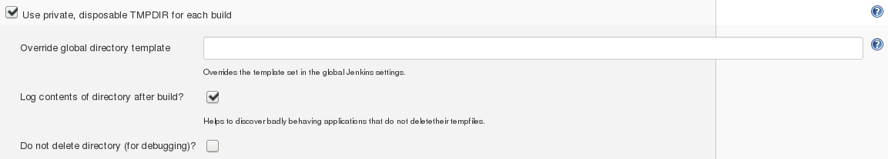
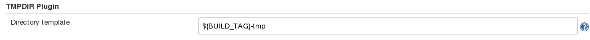

TMPDIR Jenkins Plugin
=====================

.. contents::

This is a Jenkins_ plugin to manage temporary directories for jobs.

In particular, this plugin creates a private temporary directory for
each build of a job and sets the correct environment variables so that
programs run by the job make use of this directory.

After the build, the contents of the temporary directory are logged and
the directory is deleted. This has multiple advantages:

1. The system-wide temporary directory is kept clean.
2. You can easily discover applications that are not well-behaved, i. e.
   applications that do not clean up their temporary files.
   While certain operating systems automatically clean up their temporary
   directory, others do not. Therefore, applications should always delete
   their temporary files.

Supported operating systems
---------------------------

- Microsoft® Windows®
- UNIXoid systems (Linux, Mac OS, ...)

Supported Jenkins versions
--------------------------

- Jenkins v2.60.2 or newer

Using the plugin
----------------

After the plugin has been installed, you can start using it right away.

Job settings
++++++++++++

In the *Build Environment* section of each job configuration page, you
will notice a new checkbox (unchecked by default):

Checking the checkbox is enough to activate the plugin. No further configuration is
necessary. However, you can click the *Advanced* button, if you are interested. This
will show the following settings:

Detailed help information can be obtained by clicking the blue question mark symbols
next to the form fields.

Global settings
+++++++++++++++

There is one global plugin setting that can be overriden on a per-job basis
(using the *Override global directory template* job setting).

The plugin needs to know how to name the temporary directory for a build.
In the global Jenkins settings (*Manage Jenkins* → *Configure System*), you
will find the following setting:

Click the blue question mark symbol next to the form field for more information.

Caveats
-------

This plugin exports several environment variables to ensure that all common programs
make use of the temporary directory:

- ``TMP``, ``TEMP``: In order to set the temporary directory for Windows applications.
- ``TMPDIR``: In order to set the temporary directory for POSIX applications.
- ``JAVA_TOOL_OPTIONS``: The Java system property ``java.io.tmpdir`` is set using this
  environment variable. If this environment variable is already set, then we append to
  its existing value.

.. important::

    In order to prevent conflicts, make sure that these variables **are not already set in
    any node settings or the global Jenkins settings**.

    Using *another* Jenkins plugin to set those variables in a job that also uses *this*
    plugin may lead to undefined behaviour as well.

Example
-------

This is an excerpt from the build log of a job using this plugin::

    [TMPDIR] Creating temporary directory: /tmp/jenkins-Foobar-30-tmp

    ... Build is executed ...

    [TMPDIR] ----- Listing leftover files in directory /tmp/jenkins-Foobar-30-tmp -----
    [TMPDIR]  DIR           0 B  tmp.opvvhe0n49/
    [TMPDIR]                5 B  tmp.opvvhe0n49/5
    [TMPDIR]                0 B  tmp.opvvhe0n49/FILE1
    [TMPDIR]                0 B  tmp.opvvhe0n49/FILEz
    [TMPDIR]                0 B  tmp.opvvhe0n49/a
    [TMPDIR]  DIR           0 B  tmp.opvvhe0n49/bar/
    [TMPDIR]                0 B  tmp.opvvhe0n49/bar/FILE2
    [TMPDIR]  DIR           0 B  tmp.opvvhe0n49/bar/baz/
    [TMPDIR]                0 B  tmp.opvvhe0n49/bar/zzz
    [TMPDIR] ----- End of directory listing -----
    [TMPDIR] Deleting directory: /tmp/jenkins-Foobar-30-tmp

Support
-------

This is not an Acrolinx product. It is a helper tool and provided as is. We do not support
this program.

License
-------

Copyright 2017 Acrolinx GmbH

Licensed under the Apache License, Version 2.0 (the "License");
you may not use this file except in compliance with the License.
You may obtain a copy of the License at
http://www.apache.org/licenses/LICENSE-2.0.

Unless required by applicable law or agreed to in writing, software
distributed under the License is distributed on an "AS IS" BASIS,
WITHOUT WARRANTIES OR CONDITIONS OF ANY KIND, either express or implied.
See the License for the specific language governing permissions and
limitations under the License.

.. _Jenkins: https://jenkins.io/
